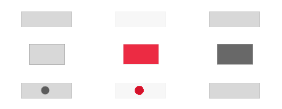

This tool is a (very slow ruby based) prototype for a screenshots diffing tool which deals well with shots of different height. It is used in a CI script to control the markup regressions using readable image comparison.

# Why write comparison tool?

Reason to invent the wheel is that ImageMagick's `compare` tool refuses to compare images of mismatching dimensions. The approach made in this tool is to use real textual `diff` command to find rows of two images where a difference starts and then patch the gap with a spacer in a way optimised for diffing interfaces (web pages, applications, anything of fixed width). The result is a pair of the original images but now of the same height then compared by ImageMagick's compare.

For people googling using the error message: `compare: image widths or heights differ … @ error/compare.c/CompareImageCommand/990.`.

# Example

Two screenshots of a slightly different height:

 

The diff:

On the left side of the diff you see a bit patched image: the removed parts have been replaced with the last pixels row from the image (kinda like Content-Aware Scale™). Swapping `a` and `b` does not change the diff in the middle.

# Guts

ATM the script is pretty simple. It converts both images to a textual format [Netpbm](http://www.imagemagick.org/Usage/formats/#pbmplus_imagemagick) a like but with full RGB support. Then the script uses a plain old `diff` tool to get the actual diff. Next step is to rebuild both images filling the gaps if a diff chung has more minuses than pluses (or vise versa). After that, the script converts the textual image format to PNG and runs the actual ImageMagick `compare` tool.

Ruby code is based on examples from [RMagick User's Guide](http://www.simplesystems.org/RMagick/doc/image2.html).
